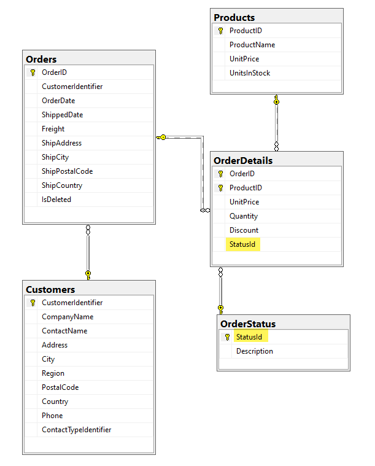
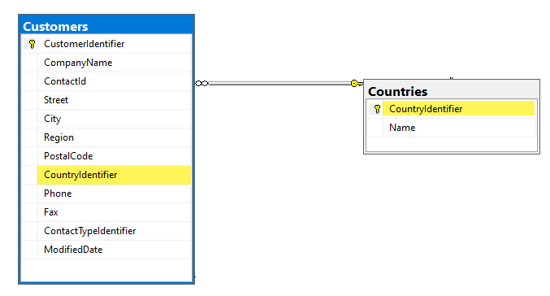

# About

For this code sample I made a subset of data from Microsoft NorthWind database I have been making modifications too in `UseThisScript.sql`.

The focus is on having a status for order detail records. If we then look at Customers.Country which is a string is wrong, the better solution is shown in `Figure 2`  which is in `NextLevel.sql` which does not have the status columns. The reasoning behind this is to show a) there is always remove for improvement b) I didn't want to modify OrderDetails table, add a status column and populate 1,000 rows.

With that mentioned, we are focusing on the status identifier used rather than text which over time can change.

**Figure 1**

**Figure 2**

