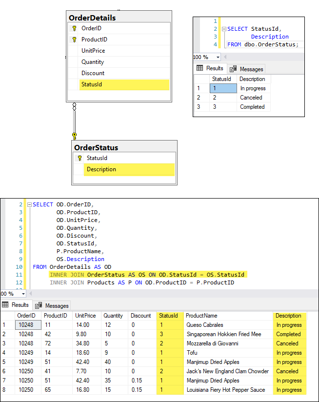
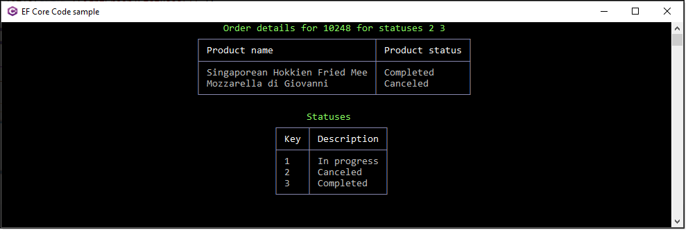

# Considerations for modeling a database with EF Core

When new developers/coders first start out writing data centric applications they tend to not to think through their design. 

Number one mistake is to create one table that should had been a main table with child tables. For example, the model for orders high level, a customer table to stored customer details, a category table with a product table then an order and order details table. 

The new developer thought, if we can ship a partial order they will create a status column with string values for Pending, In Progress, Canceled and Completed.

But what happens when the client they made the application for decides they want to change the status for Completed to Done? This means the developer must alter all statues of Completed to Done in SQL.

Later the client decides to change Pending to something else, same as with Completed to Done, the current records need to be changed in SQL.

The solution would had been to consider this at the start. Too many new developers/coders never learn how to properly create a database design that is fluid, open to change.

Let’s focus on the OrderDetail table with a status column of string, we can introduce a new table to hold status codes.

In the image below the OrderDetails table has a column StatusId which related to StatusId in OrderStatus table. Using an [INNER JOIN](https://www.w3schools.com/sql/sql_join_inner.asp) for `conventional SQL` or a [Include](https://docs.microsoft.com/en-us/dotnet/api/microsoft.entityframeworkcore.entityframeworkqueryableextensions.include?view=efcore-6.0) or [ThenInclude](https://docs.microsoft.com/en-us/dotnet/api/microsoft.entityframeworkcore.entityframeworkqueryableextensions.theninclude?view=efcore-6.0) extensions for `EF Core` we can get the description for the status id. This means that if a client decides to change the text of a status the only change is in the status code table.



The following shows results for querying by order number than multiple status codes which will work with one or more status codes as the second parameter is an integer array.

```csharp
public static async Task<List<OrderDetails>> OrdersDetailsListTask(int orderId, int[] identifiers)
{
    await using var context = new NorthContext();

    /*
     * We could simple return the following but for learning this allows a developer to examine results via the debugger
     */
    var data = context
        .OrderDetails
        .Include(od => od.Product)
        .Include(od => od.Status)
        .Where(od =>
            od.OrderId == orderId &&
            identifiers.Contains(od.Status.StatusId))
        .ToListAsync();

    return await data;
}
```

---

Screenshot from code sample using code above. Note Spectre.Console NuGet package [](https://www.nuget.org/packages/Spectre.Console/0.44.1-preview.0.29)  is used for placing results into tables [](https://spectreconsole.net/widgets/table).



A similar example, a coder stores country names in a main table while the better solution is to have a country table with a primary key and country name at the very least and use it as with the status for order details.

It’s not always going to be this simple, consider storing a contact. We should have a child table for device type (see also tables in `NextLevelScript.sql` for how this can be done) with Home phone, Work Phone, Email etc and that would allow more devices for selecting in a user interface and store in a database. Same for storing address information, a new coder might have multiple tables for different types of addresses where the same logic for device type and order status should be applied.

# Using the code sample

1. Run the script `UseThisScript.sql` in the folder `Database scripts` either by running directly in Visual Studio or in SSMS (SQL-Server Management Studio)
2. If NuGet packages are not auto-restore from the command line of the project run `dotnet restore`
3. Build
4. Run

## Connection string


Is stored in `NorthContext.cs`, for real applications store in a `appsetting.json` file. See the following [](https://github.com/karenpayneoregon/configuration-helpers) for more on how this can be done.

```csharp
protected override void OnConfiguring(DbContextOptionsBuilder optionsBuilder)
{
    if (!optionsBuilder.IsConfigured)
    {
        optionsBuilder.UseSqlServer("Data Source=(localdb)\\MSSQLLocalDB;Initial Catalog=NorthWindAzure3;Integrated Security=True");
    }
}
```


# Summary

When designing database don’t create one without understanding how to properly [design](https://en.wikipedia.org/wiki/Database_design#:~:text=Database%20design%20is%20the%20organization,system%20manages%20the%20data%20accordingly.) for your client needs in a relational manner.

:heavy_check_mark: A little extra time up front can save you from the pain of refactoring a database.

# My related articles

Several articles/code samples that are related to this article

- Writing SQL for your application [](https://github.com/karenpayneoregon/writing-sql-queries-csharp)
- EF Core Value Conversions [](https://github.com/karenpayneoregon/ef-core-transforming)

# Model generation

Database was reverse engineered using [EF Power Tools](https://marketplace.visualstudio.com/items?itemName=ErikEJ.EFCorePowerTools).

# References

- Microsofof SQL Server Design Considerations [](https://docs.microsoft.com/en-us/system-center/scom/plan-sqlserver-design?view=sc-om-2022)
- Wikipedia Database design [](https://en.wikipedia.org/wiki/Database_design#:~:text=Database%20design%20is%20the%20organization,system%20manages%20the%20data%20accordingly)
- Entity Framework Core 5 – Pitfalls To Avoid and Ideas to Try [](https://blog.jetbrains.com/dotnet/2021/02/24/entity-framework-core-5-pitfalls-to-avoid-and-ideas-to-try/)